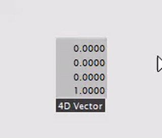

# Preset Manager for vvvv
Preset Manager is an easy and fast way for saving predefined settings in your vvvv patch. It makes use of the node expose functionality in vvvv to save and load values to and from a .xml file.

## Usage
1 - Select and press  "CTRL+K" to expose an IOBox to the Preset Manager (Exposed IOBoxes will turn green)

2 - Everytime a new IOBox  is exposed it needs to be updated (value change), before saving the preset in order to update the IOBox value and Bin Size in the preset Manager

3 - To Save a new preset: Select the Path in "Save As" and hit  "Save New"

4 - "Save" will save to the current preset.

5 - A Preset Folder will be created inside of your root folder with a "Default.xml", do not delete this file as it stores the Default Values and Bin Size of the Node you expose and load them everytime you start the patch.

## Supported Types

	- IOBox (value Spread)
	- IOBox (color Spread)

## License
[MIT](https://choosealicense.com/licenses/mit/)
